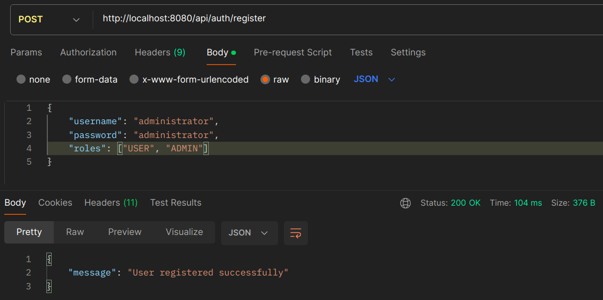
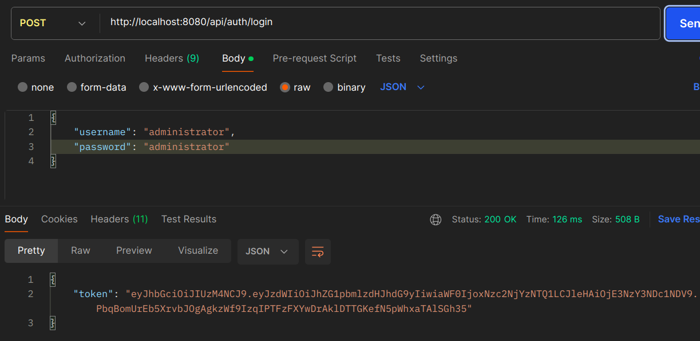
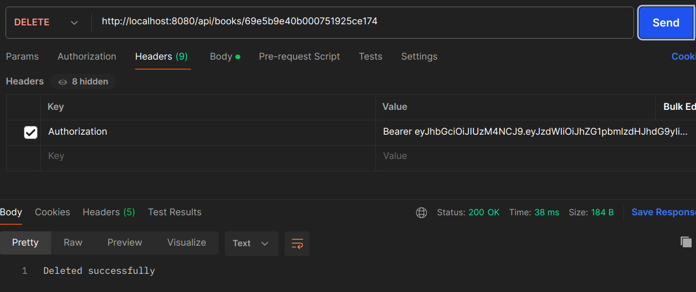
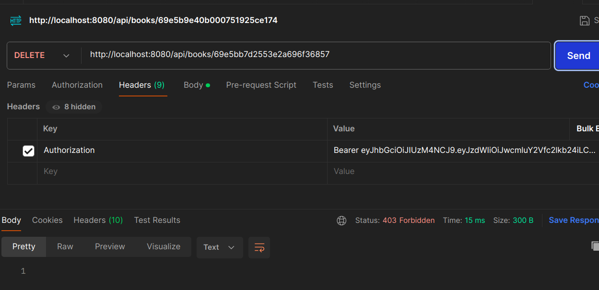

# JWT_bookstore

This project is a book store API that implements role-based access control using JWT.

Requires mongod daemon.

Registering an ADMIN user

Logging in as an ADMIN user

DELETE request as ADMIN

DELETE request as USER
